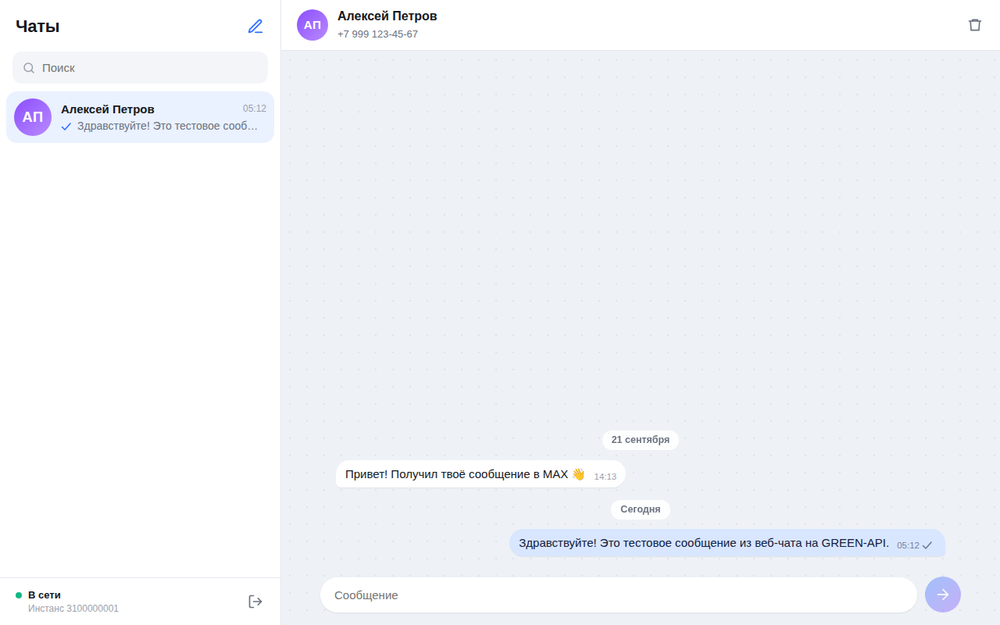

# MAX Chat — веб-чат на GREEN-API

Тестовое задание на должность «Фронтенд-разработчик React».

Простой веб-интерфейс для отправки и получения текстовых сообщений в мессенджере **MAX** через [GREEN-API](https://green-api.com/max). Внешний вид — по мотивам [web.max.ru](https://web.max.ru/).

**Демо:** _ССЫЛКА_НА_VERCEL_



## Возможности

- Вход по учётным данным инстанса GREEN-API (`idInstance`, `apiTokenInstance`) с проверкой, что инстанс авторизован в MAX.
- Создание чата по номеру телефона получателя.
- Отправка текстовых сообщений (до 4000 символов). Enter — отправить, Shift+Enter — новая строка.
- Получение ответов в реальном времени (HTTP API, long polling).
- Статусы сообщений: отправляется → отправлено → доставлено → прочитано; ошибка с кнопкой «Повторить».
- Если собеседник пишет первым, чат создаётся автоматически; счётчик непрочитанных.
- История и учётные данные сохраняются в браузере (`localStorage`), кнопка «Выйти» их очищает.
- Адаптивная вёрстка (на телефоне — один экран за раз), тёмная тема по системной настройке.

## Как это работает

| Шаг | Метод GREEN-API |
| --- | --- |
| Проверка учётных данных | [`getStateInstance`](https://green-api.com/v3/docs/api/account/GetStateInstance/) — нужен статус `authorized` |
| Новый чат по номеру | [`checkAccount`](https://green-api.com/v3/docs/api/service/CheckAccount/) → `chatId` |
| Отправка | [`sendMessage`](https://green-api.com/v3/docs/api/sending/SendMessage/) |
| Получение | [HTTP API](https://green-api.com/v3/docs/api/receiving/technology-http-api/): `receiveNotification` (ожидание до 20 с) → обработка → `deleteNotification` |

**Почему `checkAccount`.** В MAX чат адресуется числовым `chatId`, а не номером телефона. Приложение один раз получает `chatId` по номеру и отправляет все сообщения на него — тогда ответы собеседника (приходят с тем же `chatId`) попадают в нужный чат.

**Очередь уведомлений.** Каждое уведомление удаляется из очереди после обработки, даже если его тип не поддерживается (изображения, статусы инстанса и т. п.), — иначе очередь «застревает». Обрабатываются `incomingMessageReceived`, `outgoingMessageReceived`, `outgoingAPIMessageReceived` (эхо, дедуплицируется по `idMessage`) и `outgoingMessageStatus`.

**Без бэкенда.** Браузер обращается к GREEN-API напрямую, токен уходит только на указанный `apiUrl`.

## Подготовка инстанса GREEN-API

1. Зарегистрируйтесь в [личном кабинете](https://console.green-api.com) и создайте инстанс **MAX** (подходит бесплатный тариф «Разработчик»).
2. Авторизуйте инстанс: отсканируйте QR-код в приложении MAX. Статус должен стать `authorized`.
3. В настройках инстанса включите получение входящих уведомлений (`incomingWebhook`) и уведомлений об исходящих сообщениях и статусах; поле `webhookUrl` оставьте пустым — иначе уведомления уйдут на вебхук, а не в очередь HTTP API. После сохранения подождите около минуты.
4. Скопируйте `apiUrl`, `idInstance` и `apiTokenInstance`.

## Локальный запуск

Требуется **Node.js 18+**.

```bash
git clone https://github.com/<ваш-логин>/green-api-max-chat.git
cd green-api-max-chat
npm install
npm run dev
```

Откройте http://localhost:5173.

1. Введите `idInstance` и `apiTokenInstance` (при необходимости раскройте «apiUrl инстанса» и укажите адрес из кабинета, например `https://3100.api.green-api.com`).
2. Нажмите кнопку «Новый чат» и введите номер получателя в международном формате, например `+7 999 123 45 67`.
3. Напишите сообщение и нажмите Enter.
4. Ответьте с телефона получателя в MAX — ответ появится в чате через несколько секунд.

### Другие команды

```bash
npm run build     # проверка типов и production-сборка в dist/
npm run preview   # локальный просмотр сборки
npm test          # unit-тесты (Vitest)
```

## Структура

```
src/
  api/greenApi.ts              обёртка над REST API GREEN-API, понятные тексты ошибок
  hooks/useNotificationPolling цикл receiveNotification → deleteNotification с переподключением
  store/chatReducer.ts         состояние чатов: отправка, статусы, дедупликация, непрочитанные
  store/storage.ts             сохранение в localStorage
  utils/notifications.ts       разбор уведомлений в события
  components/                  LoginScreen, Sidebar, ChatWindow, Composer, NewChatDialog
  __tests__/                   тесты разбора уведомлений и редьюсера
```

## Стек

React 18, TypeScript, Vite, Vitest. Без UI-библиотек и сторонних зависимостей в рантайме.

## Ограничения

- Только текстовые сообщения и личные чаты — по условию задания.
- Галочка «отправлено» означает, что GREEN-API принял сообщение; «доставлено» и «прочитано» приходят через `outgoingMessageStatus`, если эти уведомления включены в настройках инстанса.
- История хранится только в этом браузере; сообщения, пришедшие до первого входа, не подгружаются.
